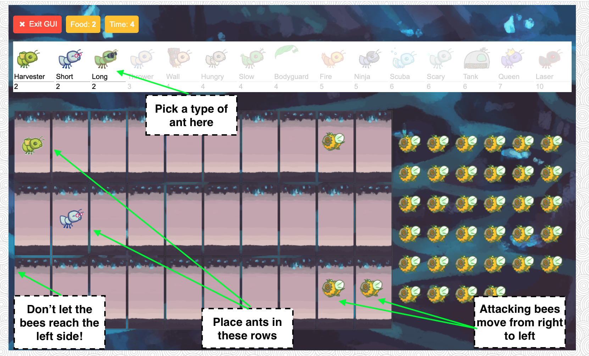

<h1> Ants VS. SomeBees </h1>
<h3> About Game </h3>

This is a tower defense game project developed Backend server in Python and Frontend Web in HTML CSS and JavaScript.

    

 

Just like the popular game Plants Vs. Zombies, palyer populate their colony with the bravest ants, that protect their queen from the evil bees that invade their territory. The game consists of a series of turns. In each turn, new bees may enter the ant colony. Then, new ants are placed to defend their colony. 

Finally, all insects (ants, then bees) take individual actions. Bees either try to move toward the end of the tunnel or sting ants in their way. Ants perform a different action depending on their type, such as collecting more food or throwing leaves at the bees. The game ends either when a bee reaches the end of the tunnel (Player lose), the bees destroy a QueenAnt if it exists (Player lose), or the entire bee fleet has been vanquished (Player win).

    

 

<h3>Play Game </h3>

The following is an Object Map to visualize how all the classes fit together.

    

 

The game can be run in two modes: as a text-based game or using a graphical user interface (GUI). The game logic is the same in either case, but the GUI enforces a turn time limit that makes playing the game more exciting. The text-based interface is provided for debugging and development.

To start a text-based game, run <strong>python3 ants_text.py</strong>
 

To start a graphical game, run <strong>python3 gui.py</strong> and a new browser window should appear with the home page.

The game has several options that you will use throughout the project, which you can view with <strong>python3 ants_text.py --help<strong>.

<blockquote>
ants_text.py [-h] [-d DIFFICULTY] [-w] [--food FOOD]  

-h, --help     show this help message and exit

-d DIFFICULTY  sets difficulty of game (test/easy/normal/hard/extra-hard)

-w, --water    loads a full layout with water

--food FOOD    number of food to start with when testing
</blockquote>

